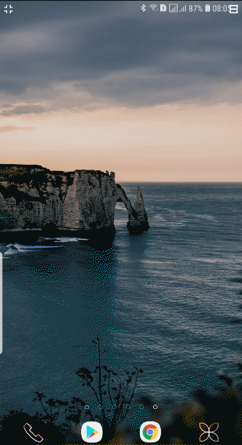
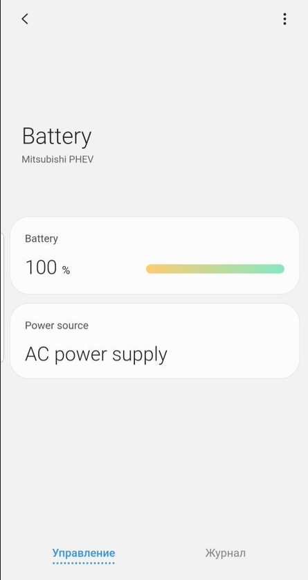

# Mitsubishi Outlander PHEV remote control over GSM(3g, 4g, LTE)

- 
- [](https://github.com/vzakharchenko/remote-ctrl-gsm/actions/workflows/docker.yml)


## Description

To access Mitsubishi Outlander Remote Control module via the Internet, you need a mikrotik lte wireless access point for example [ltap mini lte kit](https://mikrotik.com/product/ltap_mini_lte_kit)
You also need a mikrotik router at home or anywhere else with a WHITE IP (Public Ip) or Cloud with a white IP(a cheap cloud can be bought for example [here](https://www.scaleway.com/en/).
The main idea of project is access to outlander phev Wifi module through VPN tunnel, and then control  the vehicle through a modified native application.
-   


## Features
- control vehicle through 3g,4g,lte
- simultaneous access to the internet and car network via a separate WiFI SSID
- works [through the cloud](./cloud) or through [another microtik with a public ip](https://github.com/vzakharchenko/remote-ctrl-gsm/wiki/gsm-extender-home)
- [Can be used as a Wi-Fi extender](https://github.com/vzakharchenko/remote-ctrl-gsm/wiki/WiFi-Extender)
- [example working with scaleway cloud](https://github.com/vzakharchenko/remote-ctrl-gsm/wiki/gsm-extender-scaleway-cloud)
- [example working with hetzner cloud](https://github.com/vzakharchenko/remote-ctrl-gsm/wiki/gsm-extender-hetzner-cloud)
- docker images include [phevctl](https://github.com/phev-remote/phevctl)
- docker images include [Smartthings application server](https://github.com/vzakharchenko/smartthings-phevctl)
- smartthings works on [android](https://play.google.com/store/apps/details?id=com.samsung.android.oneconnect) and [apple](https://apps.apple.com/us/app/smartthings/id1222822904)
- support unlimited number of registered devices
- all vehicle settings are visible.
- you can [change the MAC address](#change-mac-address) that the app sends to the EV Remote.
- installed as a separate application (GSM Remote Ctrl)

## Smartthings Integration
- [Smartthings application configuration](https://github.com/vzakharchenko/smartthings-phevctl)
- 
- 
- 
- [Smartthings application configuration](https://github.com/vzakharchenko/smartthings-phevctl)
- Smartthings entry point:
```
http://<CLOUD_HOST>:8080
```
- Login: admin
- Default password: admin


## Modified application https://play.google.com/store/apps/details?id=com.inventec.iMobile2
What changed:
1. Removed Wi-Fi connection requirement.
2. The ability to change MAC address.
3. The ability to change the Ip address and port of EV module.
4. The ability to share registrations between devices
5. changed name of application (GSM/Cloud Remote Ctrl)

## How to move registration from one device to another
1. copy /storage/emulated/0/phev folder from registered device to a new device
2. install app on new device
3. run application and use it

## Build Application
1. Setup java JDK on computer.
2. Create your own key for signing the application (once)
'''
./generateKey.sh
'''
3. Build and signing application
'''
./buildAndSign.sh
'''
3. setup OUTLANDER_PHEV.apk on smartphone


# Change Mac address
1.  [Mikrotik in the car] (https://mikrotik.com/product/ltap_mini_lte_kit)
```
interface wireless set MitsubihiWiFI station-bridge-clone-mac="XX:XX:XX:XX:XX:XX" mac-address="XX:XX:XX:XX:XX:XX"
```
2. Change mac-address in the file on Phone storage ```/storage/emulated/0/phev/mac.txt``` from 6C:C7:EC:2B:00:00 to XX:XX:XX:XX:XX:XX
Where XX:XX:XX:XX:XX:XX is new Mac address
3. on Device
```/storage/emulated/0/phev/mac.txt```

## Change Car Gateway Ip and Port
1. Ip (default is 192.168.8.46):
```/storage/emulated/0/phev/ip.txt```
2. Port(default is 8080):
```/storage/emulated/0/phev/port.txt```


# Registration


