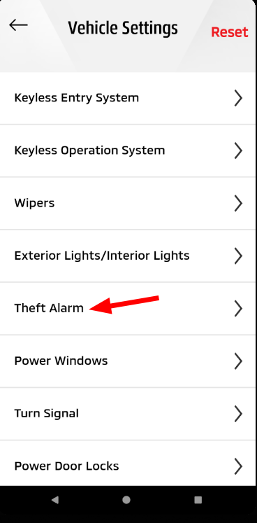
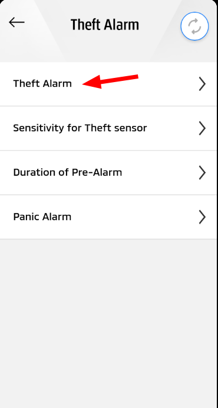
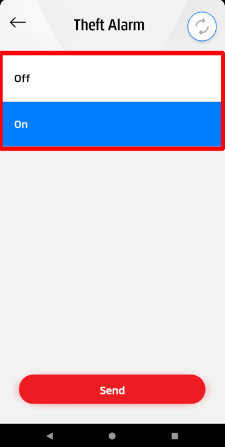
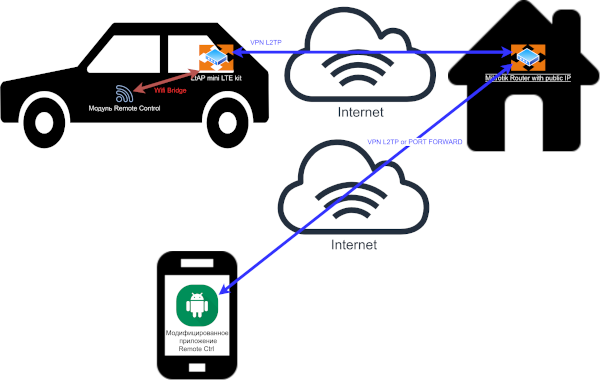
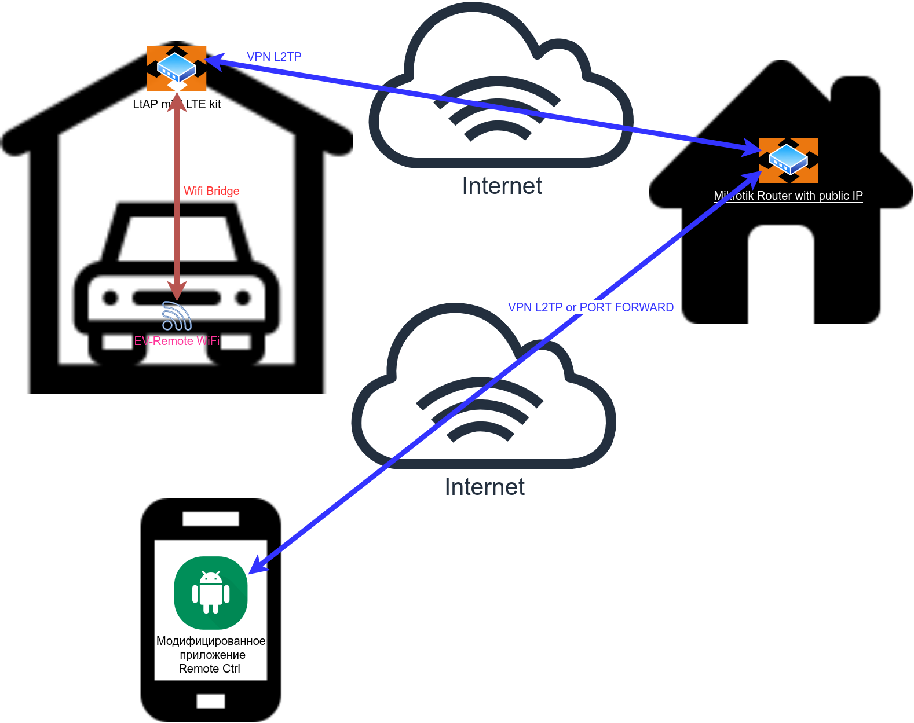

# Mitsubishi Outlander PHEV remote control over GSM(3g, 4g, LTE)

    
[](https://secure.wayforpay.com/button/bca19c6085e34)    

## Description

To access Mitsubishi Outlander Remote Control module via the Internet, you need a mikrotik lte wireless access point for example [ltap mini lte kit](https://mikrotik.com/product/ltap_mini_lte_kit)  
You also need a mikrotik router at home or anywhere else with a WHITE IP (Public Ip) or Cloud with a white IP(a cheap cloud can be bought for example [here](https://www.scaleway.com/en/)  
The main idea of project is access to outlander phev Wifi module through VPN tunnel, and then control  the vehicle through a modified native application.  
  
  
  
  
  
  

## Features  
 - control vehicle through 3g,4g,lte  
 - support unlimited number of registered devices  
 - enable/disable Theft Alarm  
 - installed as a separate application (GSM Remote Ctrl)  
  - works well with original app, but you always need to connect to mikrotik WiFi

## Requirements
1. Setup Mikrotik ltap mini lte kit to the vehicle  
2. Setup (Mikrotik Hap AC2)[https://mikrotik.com/product/hap_ac2] (or analog) at home with public IP or buy the virtual machine with public IP on the cloud.  

## Modified application https://play.google.com/store/apps/details?id=com.inventec.iMobile2
What changed:  
1. Removed Wi-Fi connection requirement.  
2. set the MAC address of the device to 6C:C7:EC:2B:00:00.  

## How to move registration from one device to another  
1. copy /storage/emulated/0/phev folder from registered device to a new device  
2. install app on new device  
3. run application and use it  

## Build Application  
1. Setup java JDK on computer.  
2. Create your own key for signing the application (once)  
'''
./generateKey.sh
'''
3. Build and signing application  
'''
./buildAndSign.sh
'''
3. setup OUTLANDER_PHEV.apk on smartphone  

## Ways to build a tunnel   
1. A convenient way, but not a secure way of port forwarding  
2. Fully secure VPN tunnel. To gain access, you need to raise a tunnel  
  
or    
  


## Setup Mikrotik with public IP (Mikrotik hap ac2 or analog)
```/ip firewall filter
add action=accept chain=input comment="L2TP Rule" protocol=ipsec-esp
add action=accept chain=input comment="L2TP Rule" dst-port=1701 protocol=udp
add action=accept chain=input comment="L2TP Rule" dst-port=500 protocol=udp
add action=accept chain=input comment="L2TP Rule" dst-port=4500 protocol=udp
add action=accept chain=input comment="access router from VPN" in-interface=all-ppp
add action=accept chain=forward comment="defconf: accept in ipsec policy" ipsec-policy=in,ipsec
add action=accept chain=forward comment="defconf: accept out ipsec policy" ipsec-policy=out,ipsec

/ip firewall mangle
add action=mark-routing chain=prerouting disabled=yes dst-address=192.168.8.0/24 new-routing-mark=CAR_ROUTE passthrough=yes
add action=change-mss chain=postrouting new-mss=clamp-to-pmtu out-interface=all-ppp passthrough=yes protocol=tcp tcp-flags=syn


/ppp profile
add change-tcp-mss=yes local-address=VPN-L2TP name=Car_Profile remote-address=VPN_LOCAL use-compression=yes use-encryption=required

/ppp secret
add name=carUser password=carUser profile=Car_Profile remote-address=192.168.188.99 service=l2tp
add name=vpnUser password=vpnUser profile=Car_Profile remote-address=192.168.188.98 service=l2tp

ip pool
add name=VPN_LOCAL ranges=192.100.201.6-192.100.201.99
add name=VPN-L2TP ranges=192.168.4.49-192.168.4.98

/interface l2tp-server server

set allow-fast-path=yes authentication=pap default-profile=Car_Profile enabled=yes ipsec-secret=5TpfVoyORsfy72i3p2Cvmg8 max-mru=1500 max-mtu=1500 use-ipsec=required

/ip route
add distance=1 dst-address=192.168.8.0/24 gateway=192.168.188.99
add distance=1 dst-address=192.168.188.0/24 gateway=192.168.188.99
```

## Setup Mikrotik in the car [ltap mini lte kit](https://mikrotik.com/product/ltap_mini_lte_kit)

```
/interface lte
set [ find ] name=lte1
/interface bridge
add admin-mac=74:4D:28:5C:F5:7C auto-mac=no comment=defconf name=bridge
add dhcp-snooping=yes fast-forward=no igmp-snooping=yes name=bridge2
/interface wireless
set [ find default-name=wlan1 ] band=2ghz-b/g/n country=canada disabled=no frequency=2422 mode=ap-bridge name=WiFi_Router ssid=CarWiFi wireless-protocol=802.11
/interface l2tp-client
add allow=pap connect-to=<YOUR_IP> dial-on-demand=yes disabled=no ipsec-secret=5TpfVoyORsfy72i3p2Cvmg8 keepalive-timeout=disabled name=CAR_VPN_CONNECTION password=carUser use-ipsec=yes user=carUser
/interface list
add name=WAN
add name=LAN
/interface wireless security-profiles
set [ find default=yes ] authentication-types=wpa-psk,wpa2-psk mode=dynamic-keys supplicant-identity=MikroTik wpa-pre-shared-key=3e7pUrLFgdgwIHI7qhOD4Vz wpa2-pre-shared-key=3e7pUrLFgdgwIHI7qhOD4Vz
add authentication-types=wpa-psk,wpa2-psk eap-methods="" management-protection=allowed mode=dynamic-keys name=Mitsubishi supplicant-identity="" wpa-pre-shared-key=<MITSUBISHI_PASSWORD> wpa2-pre-shared-key=<MITSUBISHI_PASSWORD>
/interface wireless
add disabled=no mac-address=6C:C7:EC:2B:00:00 master-interface=WiFi_Router mode=station-pseudobridge-clone name=MitsubihiWiFI security-profile=Mitsubishi ssid=<MITSUBISHI_SSID> station-bridge-clone-mac=6C:C7:EC:2B:00:00 wds-default-bridge=bridge
/ip hotspot profile
set [ find default=yes ] html-directory=flash/hotspot
/ip pool
add name=dhcp ranges=192.168.188.100-192.168.188.254
/ip dhcp-server
add address-pool=dhcp disabled=no interface=bridge name=dhcp1
/interface bridge port
add bridge=bridge comment=defconf interface=ether1
add bridge=bridge comment=defconf interface=WiFi_Router
add bridge=bridge2 interface=MitsubihiWiFI trusted=yes
add bridge=bridge2 comment=defconf disabled=yes interface=LAN
/interface bridge settings
set allow-fast-path=no
/ip neighbor discovery-settings
set discover-interface-list=LAN
/interface list member
add interface=lte1 list=WAN
add interface=bridge list=LAN
/ip address
add address=192.168.188.1/24 interface=ether1 network=192.168.188.0
/ip dhcp-client
add comment=defconf disabled=no
add add-default-route=no disabled=no interface=bridge2 use-peer-dns=no use-peer-ntp=no
/ip dhcp-server network
add address=192.168.188.0/24 gateway=192.168.188.1 netmask=24
/ip firewall filter
add action=accept chain=input protocol=icmp
add action=accept chain=input connection-state=established
add action=accept chain=input connection-state=related
add action=accept chain=input in-interface=all-ppp
add action=accept chain=input
add action=accept chain=forward dst-address=192.168.8.0/24
add action=drop chain=input in-interface-list=WAN
/ip firewall nat
add action=masquerade chain=srcnat out-interface-list=WAN
add action=masquerade chain=srcnat out-interface=bridge2
add action=masquerade chain=srcnat out-interface=all-ppp
add action=accept chain=srcnat src-address=192.168.8.0/24
add action=accept chain=srcnat dst-address=192.168.8.0/24
/ip route
add distance=1 dst-address=192.168.88.0/24 gateway=CAR_VPN_CONNECTION
add disabled=yes distance=1 dst-address=192.168.8.0/24 gateway=bridge2
/system clock
set time-zone-name=Europe/Kiev
/system gps
set port=serial0
/system identity
set name=CarWiFi
/system scheduler
add interval=30s name=schedule1 on-event="/system script run carTunnel" policy=ftp,reboot,read,write,policy,test,password,sniff,sensitive,romon start-date=sep/11/2020 start-time=10:21:09
add interval=5m name=schedule2 on-event="/system script run carConnectionCheck" policy=ftp,reboot,read,write,policy,test,password,sniff,sensitive,romon start-date=sep/14/2020 start-time=10:37:49
/system script
add dont-require-permissions=no name=carTunnel owner=admin policy=ftp,reboot,read,write,policy,test,password,sniff,sensitive,romon source="\r\
    \n:local HOST \"192.168.88.99\"\r\
    \n:local PINGCOUNT 3\r\
    \n:local INT \"CAR_VPN_CONNECTION\" \r\
    \n:if ([/ping address=\$HOST interface=\$INT count=\$PINGCOUNT]=0) do={\r\
    \n:global name=\"tunnelVpn\" 0\r\
    \n/log error \"\$INT is down\"\r\
    \n} else={\r\
    \n:global name=\"tunnelVpn\" 1\r\
    \n}\r\
    \n"
add dont-require-permissions=no name=carConnectionCheck owner=admin policy=ftp,reboot,read,write,policy,test,password,sniff,sensitive,romon source="\
    \n:local HOST \"192.168.8.46\"\
    \n:local PINGCOUNT 3\
    \n:local INT \"bridge2\" \
    \n:if ([/ping address=\$HOST interface=\$INT count=\$PINGCOUNT]=0) do={\
    \n:global name=\"tunnel_car\" 0\
    \n/log error \"\$INT is down\"\
    \n\
    \n/interface wireless disable MitsubihiWiFI\
    \n/log error \"MitsubihiWiFI DISABLED\"\
    \n/delay delay-time=6\
    \n/interface wireless enable MitsubihiWiFI\
    \n/log error \"MitsubihiWiFI ENABLED\"\
    \n# /delay delay-time=15\
    \n} else={\
    \n:global name=\"tunnel_car\" 1\
    \n}\
    \n"
/tool mac-server
set allowed-interface-list=LAN
/tool mac-server mac-winbox
set allowed-interface-list=LAN
```
Where  
**YOUR_IP** - public ip of home router  
**MITSUBISHI_SSID** - Name of network in OUTLANDER PHEV (REMOTE55peee)  
**MITSUBISHI_PASSWORD** - password from network  

# Ways to build a tunnel  
## Port forwarding  
1. Mikrotik with Public Ip:  
```add action=dst-nat chain=dstnat dst-port=8080 protocol=tcp to-addresses=192.168.8.46 to-ports=8080```
2. set public ip on Phone storage ```/storage/emulated/0/phev/ip.txt```  
2. set port on Phone storage ```/storage/emulated/0/phev/port.txt```  

## Fully secure VPN tunnel. To gain access, you need to raise a tunnel

1. Create Vpn connection on smartphone  
Connection paramters:  
**Type**: L2TP/IPSec PSK  
**Server Address**: <YOUR_IP>  
**Shared IPSec Key**: 5TpfVoyORsfy72i3p2Cvmg8  
**username**: vpnUser  
**password**: vpnUser  
2. Open and use application GSM Remote Ctrl  

# Change Mac address    
1.  [Mikrotik in the car] (https://mikrotik.com/product/ltap_mini_lte_kit)  
```
interface wireless set MitsubihiWiFI station-bridge-clone-mac="XX:XX:XX:XX:XX:XX" mac-address="XX:XX:XX:XX:XX:XX"
```
2. Change mac-address in the file on Phone storage ```/storage/emulated/0/phev/mac.txt``` from 6C:C7:EC:2B:00:00 to XX:XX:XX:XX:XX:XX
Where XX:XX:XX:XX:XX:XX is new Mac address  

# Connection through Cloud
1. Create a Virtual Machine on the Cloud with public IP.  
2. Setup and configure PPTP server on  the  Virtual machine  
3. Setup routing using iptables  
4. forward the port using iptables or connect via vpn  

# Registration


# If you find these useful, please [Donate](https://secure.wayforpay.com/button/bca19c6085e34)!  
